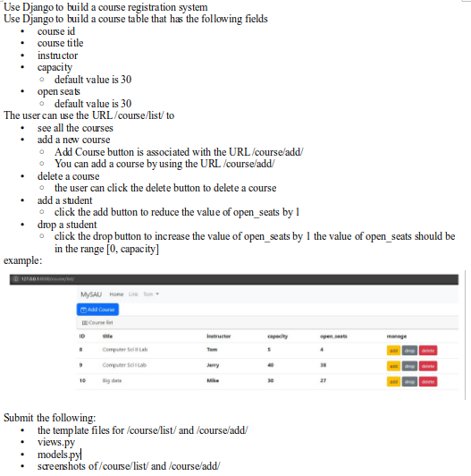
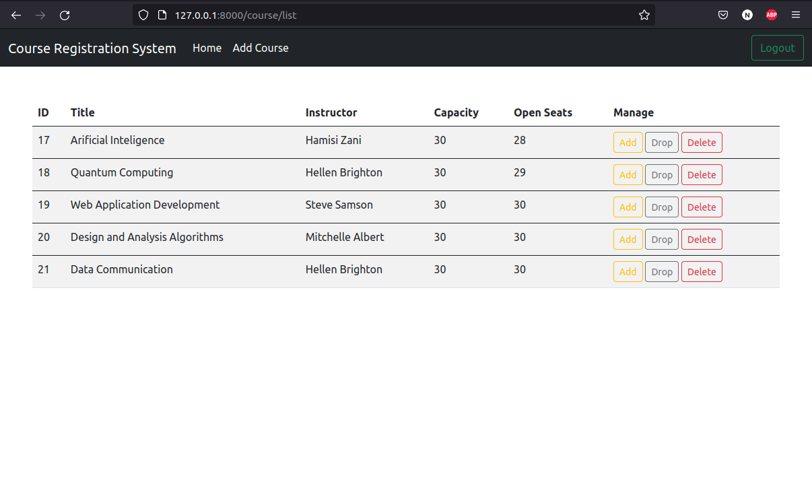
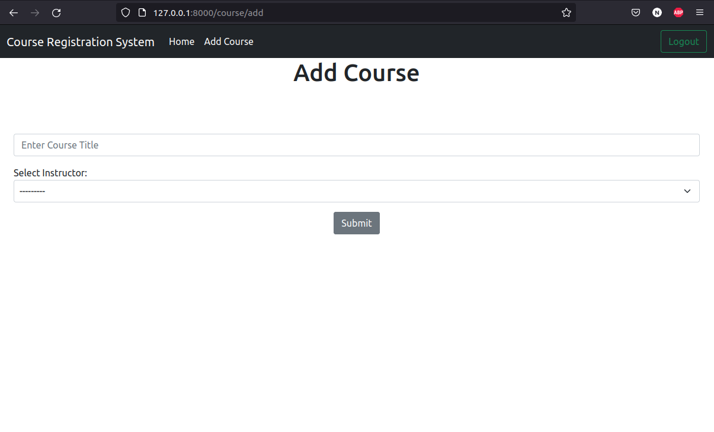
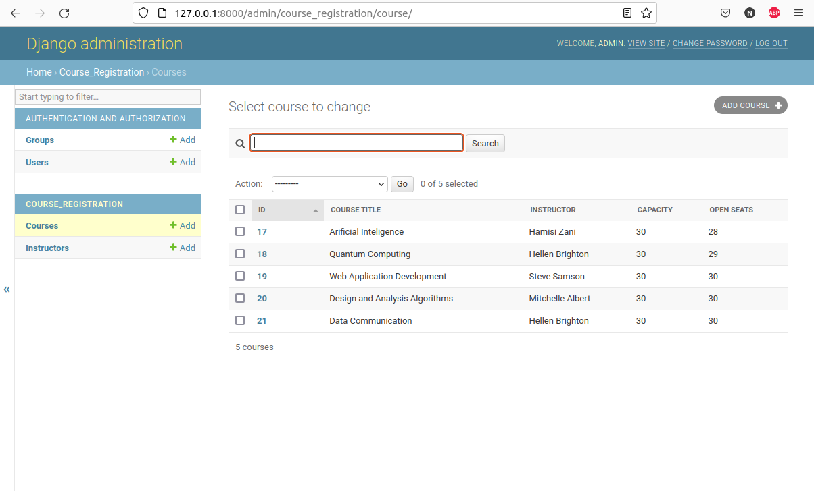
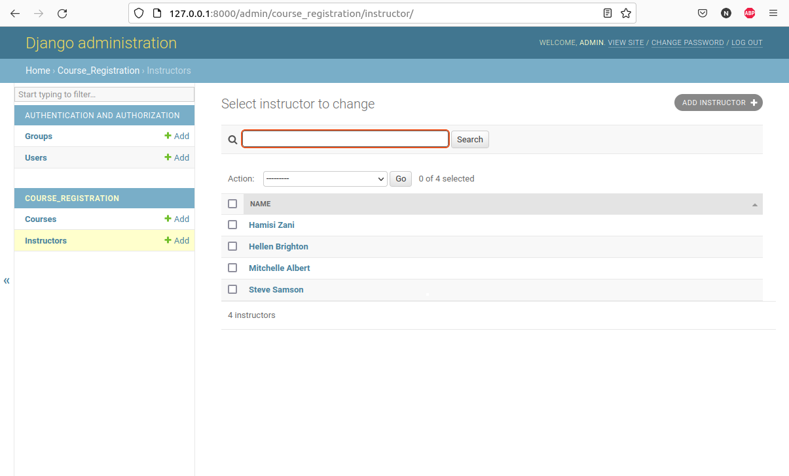
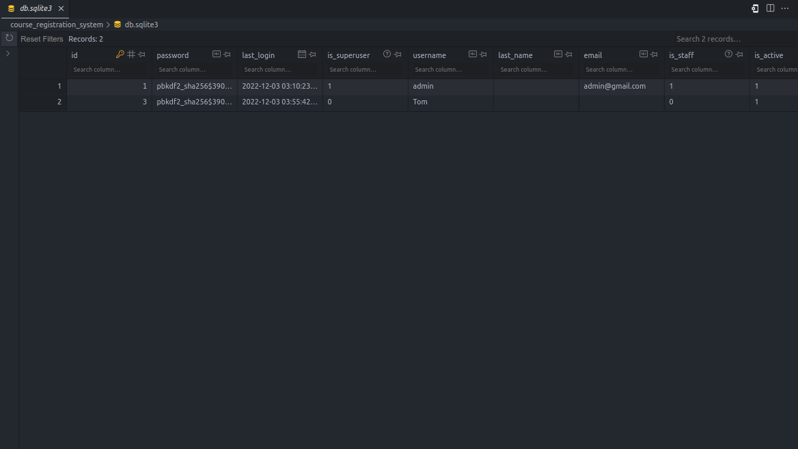

# Course Registration System
 Course Registration System created with Python
## Requirements

### Screenshots
### Course List 

### Course Add 

### Admin area
### Courses 

### Instructors 

### Users 
